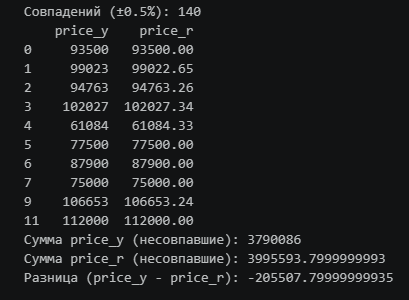

# realty

Сравнение объявлений о продаже квартир по двум базам

* Разработаны парсеры для сбора данных об объектах продажи и извлечения цен по двум различным сайтам/источникам.
* Проведен первичный анализ и очистка данных:
    - удалены дубликаты объявлений;
    - обработаны пропуски;
    - исключены ненужные/лишние колонки, чтобы упростить дальнейшую аналитику.
* Приведение датасетов к единому виду:
    - выровнено количество столбцов;
    - унифицированы названия колонок и структура данных для сопоставления.
* Сопоставление объявлений:
    - выполнен поиск аналогичных позиций в одном датасете относительно второго (по определенным критериям соответствия).
* Формирование итогового результата:
    - получен консолидированный датасет со встречающимися в обеих базах позициями (то есть пересечение двух источников).
